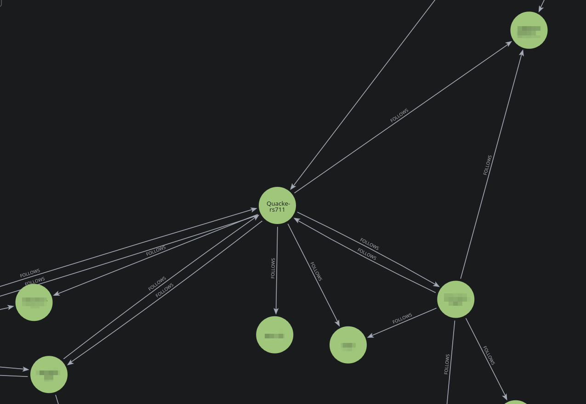

# Github Graph Mapper
An automated tool to visualize connections between followers on Github. Simply give the tool a username and it will automatically map out which users, follow which users, starting from the given user. This is visualized using the graph database, Neo4J.

## Environment variables
In order to run the script, the needed environment variables are needed:
* ``NEO4J_URI`` - Default is ``bolt://localhost:7687"``
* ``NEO4J_USER`` - Default is `neo4j`
* ``NEO4J_PASS`` - Default is `password`

And the optional variable to increase rate limits:
* `GITHUB_TOKEN` - This should be a Personal Access Token with access to the `Followers` scope.

## Usage
```
🔗 GitHub Social Graph Crawler

positional arguments:
  username           Root GitHub username to crawl

options:
  -h, --help         show this help message and exit
  -d, --depth DEPTH  Depth of crawl (default: 2)
  -b, --big          Allow crawling users with more than 100 followers
```

Example usage:
> ``python3 map.py -d 3 quackers711``

The visualization can then be seen in the Neo4J dashboard at http://127.0.0.1:7474/browser/preview/.

An example of a small sample of a visualization can be seen here:



A zoomed out example of a larger visualization:
